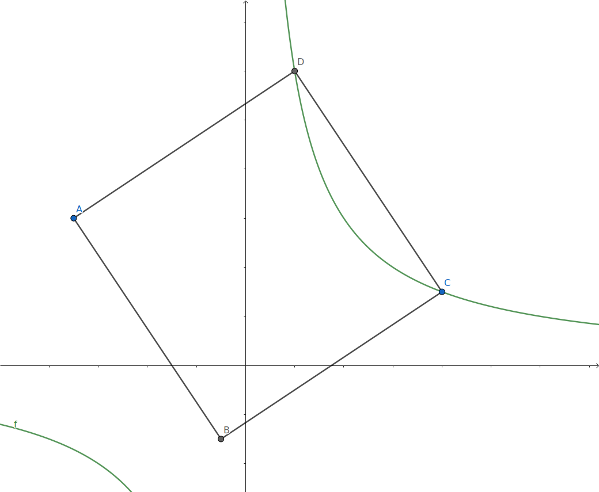

# 2024 年青岛市高一数学强基计划选拔试题

1. 如图，在 $\triangle ABC$ 中，$\angle BAC=90^\circ$，$AB=AC$，$E$ 为 $AC$ 边上一点，连接 $BE$，以 $AB$ 为直径的圆分别交 $BC,BE$ 于 $D,H$ 两点，连接 $DH$，设 $\angle ABE=\alpha$，则 $DH/DC=$

    

    | A | B | C | D |
    | :-: | :-: | :-: | :-: |
    | $1-\tan\alpha$ | $\cos\alpha-\sin\alpha$ | $\tan\alpha-\sin\alpha$ | $1-\cos\alpha$ |

    答案：B，解析如下，

    连接 $AD$，由直径所对圆周角为直角、等边三角形判定可得，$\angle BAD=45^\circ$。
    
    由同弧所对圆周角相等，得 $\angle BHD=\angle BAD=45^\circ$。

    因为 $\angle BHD=\angle ACB=45^\circ$，加上同角 $\angle CBE$，得 $\triangle BDH\backsim\triangle BCE$。

    

    那么，

    $$
    \begin{aligned}
    DH/DC&=DH/BD\\
    &=CE/BE\\
    &=\sqrt2\cdot EQ/BE\\
    &=\sqrt2\sin(45^\circ-\alpha)\\
    &=\cos\alpha-\sin\alpha
    \end{aligned}
    $$

    因此，B 正确。

2. 如图，正方形 $ABCD$ 的顶点 $C,D$ 在函数 $y=\dfrac{k}{x}(k\neq0)$ 的图像上，已知点 $A$ 的坐标为 $\left(-\dfrac72,3\right)$，点 $C$ 的横坐标为 $4$，则 $k$ 的值为

    

    | A | B | C | D |
    | :-: | :-: | :-: | :-: |
    | $5$ | $6$ | $7$ | $8$ |

    答案：B，解析如下，

    设点 $C$ 坐标为 $(4,k/4)$，点 $D$ 坐标为 $(t,k/t)$，根据 $\overrightarrow{AD}$ 和 $\overrightarrow{DC}$ 的关系，列出方程：

    $$
    \begin{cases}
    \dfrac{k}{t}-3&=4-t\\
    t+\dfrac72&=\dfrac kt-\dfrac k4
    \end{cases}
    $$

    注意到 $t>1$，因此两边同时乘以 $t$ 去掉分母：

    $$
    \begin{cases}
    k-3t&=4t-t^2\\
    4t^2+14t&=(4-t)k
    \end{cases}
    $$

    注意到只有关于 $k$ 的是一次的，因此选 $k$ 为主元，化简：

    $$
    \begin{cases}
    k&=7t-t^2\\
    k&=\dfrac{4t^2+14t}{4-t}
    \end{cases}
    $$

    我们把这两个等式看做函数，以 $t$ 为自变量，$k$ 为因变量。
    
    那么结果一定是函数图像的交点，而且要求 $k>0,0<t<4$，我们直接另两等式右侧相等。

    $$
    \begin{cases}
    7t-t^2&=\dfrac{4t^2+14t}{4-t}\\
    (7t-t^2)(4-t)&=4t^2+14t\\
    t^3-15t^2+14t&=0
    \end{cases}
    $$

    首先注意到 $t=1$ 一定是方程的一组解，我们考虑证明结果的唯一性。

    注意到 $k$ 是常量，因此点 $C$ 的位置是固定的，那么我们作出 $AC$ 的中垂线，与图像交点一定是 $D$，这的确是唯一的。

3. 已知 $a,b,c$ 满足不等式 $a^2+b^2+c^2+43\le ab+9b+8c$，则 $a,b,c$ 分别等于 $\underline{\kern{5em}}$。

    答案：$a=3,b=6,c=4$，解析如下，

    考虑配方。

    $$
    \begin{aligned}
    a^2+b^2+c^2+43-ab-9b-8c&\le0\\
    (a^2+\dfrac14b^2-ab)+\dfrac34(b^2-12b+36)+(c^2-8c+16)&\le0\\
    (a-\dfrac12b)^2+(b-6)^2+(c-4)^4&\le0
    \end{aligned}
    $$

    因此，

    $$
    \begin{cases}
    a&=\dfrac12b=3\\
    b&=6\\
    c&=4
    \end{cases}
    $$

    即 $a=3,b=6,c=4$。

4. （本题 14 分）

    已知实数 $a,b,c,m,n$ 满足 $3m+n=\dfrac ba,mn=\dfrac ca$。

    （1）求证：$b^2-12ac$ 为非负数。

    （2）若 $a,b,c$ 均为奇数，$m,n$ 是否可以都为整数？

    答案：解析如下，

    （1）注意到形式类似韦达定理、根的判别式 $\Delta$，考虑构造一元二次方程。

    $$
    ax^2-bx+3c=0
    $$

    两根分别为 $x_1=3m,x_2=n$，因为 $m,n\in\mathbb R$，则 $\Delta=b^2-12ac\ge0$。

    （2）注意到可以通过韦达定理得出的形式，讨论 $m,n$ 的奇偶性证明。

    假设 $m,n\in\mathbb Z$，则 $3m+n,mn\in\mathbb Z$，则 $a\mid b,c$。

    注意到 $a,b,c$ 为奇数，易得 $\dfrac ba,\dfrac ca$ 也都是奇数，则 $3m+n,mn$ 也都是奇数。
    
    证明：质因数分解后，分子分母指数相减，$2$ 的指数依然为 $0$，即一定是奇数。

    根据 $mn$ 是奇数，$n,m$ 一定都是奇数，那么 $3m+n$ 一定是偶数，与事实不符。

    即，一定有 $m,n$ 不可以都为整数。

